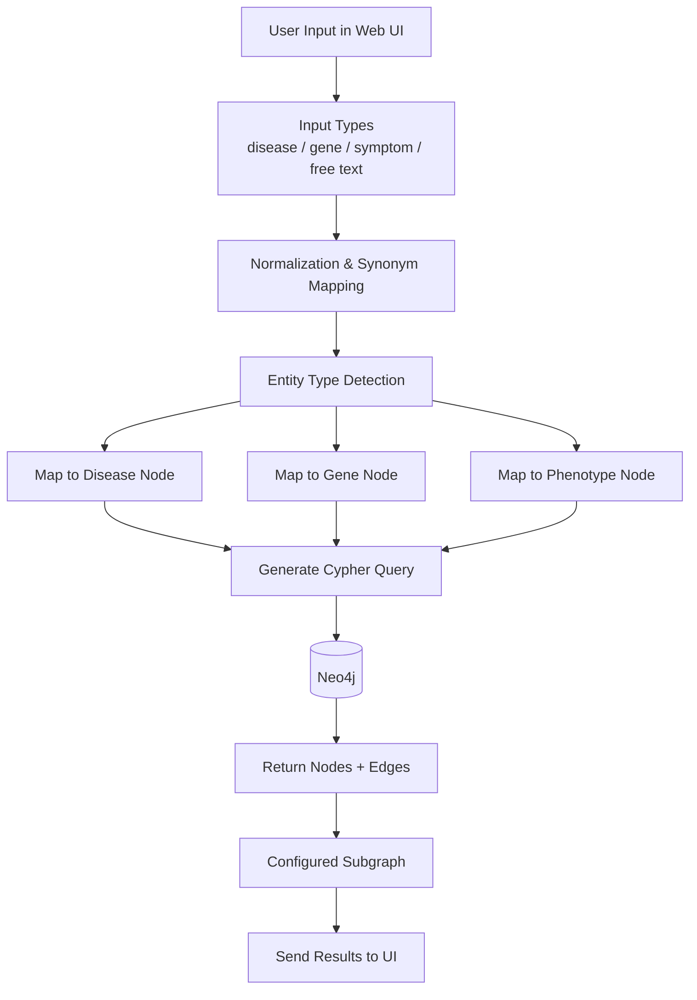

# KG Platform – Mapping & Query Flow

```mermaid
flowchart TD
  UI[User Input in Web UI] --> I1[Input Types<br/>disease / gene / symptom / free text]
  I1 --> M1[Normalization & Synonym Mapping]
  M1 --> M2[Entity Type Detection]

  M2 --> D[Map to Disease Node]
  M2 --> G[Map to Gene Node]
  M2 --> S[Map to Phenotype Node]

  D --> Q[Generate Cypher Query]
  G --> Q
  S --> Q

  Q --> N[(Neo4j)]
  N --> R[Return Nodes + Edges]
  R --> SG[Configured Subgraph]
  SG --> OUT[Send Results to UI]
```
